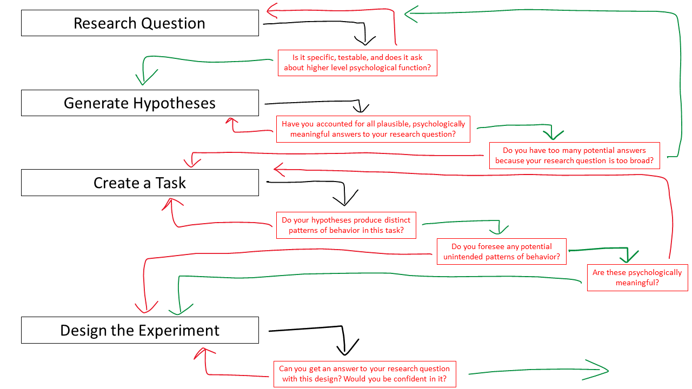

Experimental Design
***********

.. article-info::
    :avatar: dnl_plastic.png
    :avatar-link: https://www.decisionneurosciencelab.com/
    :author: Elijah Galvan
    :date: September 1, 2023
    :read-time: 3 min read
    :class-container: sd-p-2 sd-outline-muted sd-rounded-1

Goals During this Stage
================

After establishing the research question you want to answer, you must create an experimental paradigm that enables you to answer that question.
As an aspirational benchmark, every potential answer to that research question should have a distinguishable behavioral trend over the course of the experiment which enables you to differentiate between other psychological accounts. 

Here, your experimental design and hypotheses are codetermined: in reflecting on the possible answers to your research question, you should identify what behavioral patterns these psychological mechanisms would produce in the current design.

If psychological differences make behaviorally distinct predictions in the current experiment, your design is adequate. 
Importantly, at this stage it is necessary to exhaustively list both all possible psychological accounts for your question as well as the behavioral patterns in your experiment. 
The purpose of doing the latter is to identify possible behavioral differences that might not correspond to any of your psychological hypotheses, but might relate to another psychological preference. 

Tutorial
===========

So, the main goal at this stage is to identify an experimental design which allows to answer our research question, namely **What motivates people to reciprocate trust in single-shot interactions?**

Let's follow the steps mentioned above.

.. card:: Identify Plausible Answers

    Well, we already know that some people do not reciprocate trust in single-shot interactions so let's jot down ``Greed`` as our first proposed answer. 

    1. Greed

    However, most people do reciprocate trust so what explanations may we propose for this? 
    Well, traditional thought on the matter has been in favor of the explanation provided by inequity-aversion (see `Fehr & Schmidt, 1999`_ for the initial formulation of this inequity-aversion utility model).
    In other words, people value being objectively fair which leads them to reciprocate trust in the context of the 1-shot Trust Game - let's add ``Inequity Aversion`` to our list. 

    2. Inequity Aversion

    However, we also know that when people do not behave in a way that is inequity-averse when they have the opportunity to appear fair while actually being selfish in the Ultimatum Game (`Güth, Huck, & Ockenfels, 1996`_).
    Thus, rather than actually being fair, it could be the case that people reciprocate trust because they want to avoid feeling guilty for betraying the Investor's trust. 
    So, let's also add ``Guilt Aversion`` to our list as well. 

    3. Guilt Aversion. 

    Nice, we have 3 explanations - can you think of any more? 
    Well I can't and neither could the authors so let's proceed with these answers. 

.. card:: Create a Task

    We are interested in reciprocity of trust - this tells us we should most likely use the Trust Game as our task. 
    So, working under this logic, we should now identify if any of our plausible answers predict the same behavior in the Trust Game. 

    Well, Greed is certainly distinct from the other 2 - greedy people don't reciprocate and the others do. 
    However, Inequity Aversion and Guilt Aversion lead to quite similar predictions: Inequity Aversion leads to people giving around half, as does Guilt Aversion since Trustees generally believe that Investors expect to receive half of the multiplied investment back. 

    So the question now is: *How do we make Inequity Aversion and Guilt Aversion have different patterns of behavior in the Trust Game?* 
    Well clearly we have to create situations where returning half of the multiplied investment (predicted by Inequity Aversion) does not result in Investors believing that they received half of the multiplied investment back (Guilt Aversion). 
    So now the solution is more apparent: we have to manipulate Investors' beliefs about how much the multiplied investment is and since the Investor determined the investment amount, we must manipulate their beliefs about the Multiplier such that it does not match the actual Multiplier.  
    We'll tell the Investor that the Multiplier is 4: the Trustee will believe that they should expect to receive half of 4 times the what they invested (i.e 2 times what they invested). 
    However, behind the Investor's back, we'll tell the Trustee that 1) the Multiplier is either 2, 4, or 6 and 2) the Investor always believes that the Multiplier is 4. 

    So let's recap: 
    
    * When the Multiplier is 2 the Trustee believes the Investor expects the Trustee to return 2 times what the Investor invested - all of the money that the Trustee has
    * When the Multiplier is 4 the Trustee believes the Investor expects the Trustee to return 2 times what the Investor invested - half of the money that the Trustee has
    * When the Multiplier is 6 the Trustee believes the Investor expects the Trustee to return 2 times what the Investor invested - a third of the money that the Trustee has

    In all situations, it is Inequity Averse to return half of the money that the Trustee has. 
    However, when the Multiplier is 2 or 6, it is Guilt Averse to return all or a third of the money that the Trustee has.

.. card:: Design the Experiment

    So we've accomplished our goal for creating a task but now we need to decide if we should use a within-subjects or between-subjects design. 
    In all situations that I can conceive of, you should use a within-subjects design but let's think this out here for the sake of punctuality. 
    We are seeing what motivates people to reciprocate trust by manipulating Investors' expectations, so does it make sense that we only expose them to one condition? 
    If we only expose them to one condition, we cannot see how their reciprocation behavior changes as a function of the Investors' expectations relative to what is equitable, so no. 
    This would certainly be pointless - we'll stick with a within-subjects design.

    So now how many trials? 
    This one's a tough one to answer and I honestly can't give a compelling, statistically well-founded answer. 
    More is always better until it isn't, meaning it's always good to have as many trials as you can while having the subject still engaged in your task. 
    Here, they opted for 80 which is quite a lot of trials. 
    They could have certainly done this with 60 trials (they had 40 trials with the Multiplier as 4 and 20 each with the Multiplier as 2 and 6). 
    Generally, you can feel quite safe with 20 trials per condition but, having worked with the data, I can say that they could have been fine with as few as 10 trials per condition though I will only recommend a minimum of 20 per condition.

.. card:: Identify Unintended Behavioral Patterns

    So we've created a task that *would* elicit behaviorally distinct patterns for each of Greed, Inequity Averson, and Guilt Aversion if such differences indeed exist. 
    However, we have to think critically now about any additional substantial behavioral differences which might arise. 
    This might seem like a daunting task but we've already dismissed the possibility that there are other patterns of behavior *within* each condition. 

    So what's left to consider is only other patterns of behavior *between* conditions, namely:

    * People switch between Inequity Aversion when the Mutliplier is 2 and Guilt Aversion when the Multiplier is 6 (choosing the norm which prescribes returning less)

    We already know that people are motivated by material self-interest and affirmation of their moral virtue so it seems reasonable to think that they would be Morally Opportunistic - behaving prosocially in whatever way is most convenient. 
    It's also possible that people switch between Inequity Aversion when the Mutliplier is 6 and Guilt Aversion when the Multiplier is 2 (choosing the norm which prescribes returning more) or either of these and Greed, but it's not as plausible an explanation. 
    Anyway, now that we've identified potentially unintended behavioral patterns we have to ask ourselves if these would be psychologically meaningful and interesting or psychologically meaningless and uninteresting. 

    The answer here is clearly yes: if people's motive to reciprocate changes depending on the situation this is psychologically meaningful and therefore interesting. 
    Thus, we will keep the current design as is. 
    We will also keep in mind that Moral Opportunism seems a relatively likely behavioral pattern which is psychologically compelling and relates to the plausible answers we have identified for our question. 