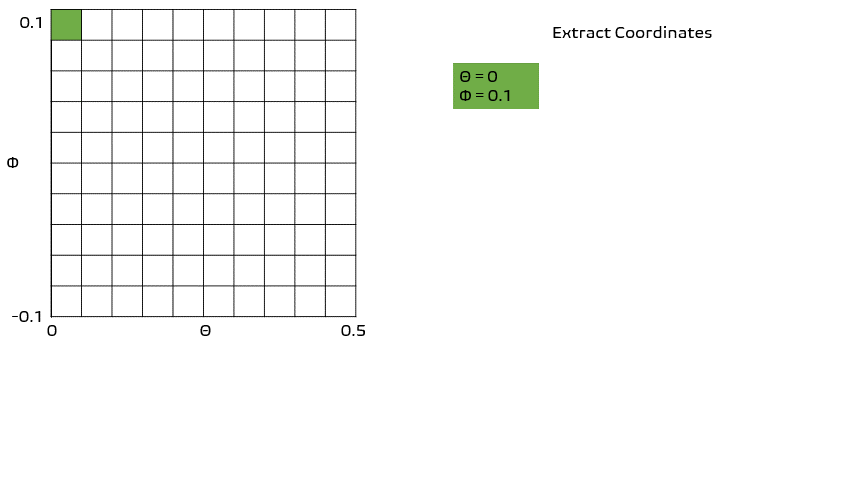

Simulating Data
*********

.. article-info::
    :avatar: dnl_plastic.png
    :avatar-link: https://www.decisionneurosciencelab.com/
    :author: Elijah Galvan
    :date: September 1, 2023
    :read-time: 10 min read
    :class-container: sd-p-2 sd-outline-muted sd-rounded-1

Goals During this Stage
================

Now we want to plug in all of the inputs that we know (experimental variables and free parameters) into the data generation process (the computational model) and see what it outputs.

Seems easy enough right? 

.. Note:: 

    Here, the path taken by MatLab will diverge. 
    In comparison with R - which is designed around long format data frames, MatLab is designed around the Matrix. 
    For beginners with access to MatLab and no particular preference about programming language, I would recommend using MatLab. 
    The idea is aligned with the above illustration: each coordinate has a cell in a structure and the contents of the cell are a structure with various fields. 
    
    I chose to keep Python in long format just like R - Python is less concise than either MatLab or R so, to reduce the amount of code to keep track of, this was preferable. 
    Nonethless, I think it is still possible to easily switch by translating the MatLab code to Python with ChatGPT.

.. dropdown:: Preallocating, Defining Functions, Defining Trial List, and Defining Parameters

    .. tab-set::

        .. tab-item:: Plain English

            Before you start simulating data, you need to check off a pretty simple list: 

                1. Define the Trial List

                * Define the value of all :bdg-primary:`Independant Variables` and all relevant :bdg-primary:`Constants` (and all possible :bdg-danger:`Decisions` if these do not change from trial-to-trial)

                2. Define Your Functions

                * Define the value of all :bdg-secondary:`Construct Value` functions and the :bdg-secondary:`Utility` function

                3. Define Your Parameters

                * Define the range and resolution of each of your :bdg-success:`Free Parameters`

                4. Preallocate Model Output

                * Preallocate the data storage structures for the model-predicted :bdg-danger:`Decisions` for each Trial, for each Coordinate

        .. tab-item:: R

            ::

                trialList = data.frame(IndependentVariable = vector(), Constant = vector())

                # choices = vector()

                construct = function(iv, constant, choice){
                    return(construct_value)
                }

                utility = function(constructs, parameters){
                    return(utility)
                }

                freeParameters = data.frame(parameter1 = vector(), 
                                            parameter2 = vector())

                predictions = data.frame()

        .. tab-item:: MatLab

            ::

                trialList = table([], [], 'VariableNames', {'IndependantVariable', 'Constant'});

                % choice

                function value = construct(iv, constant, choice)
                    value = construct_value;
                end

                function value = utility(constructs, parameters)
                    value = utility;
                end

                parameter1range = [];
                parameter2range = [];

                freeParameters = struct('parameter1', {}, 'parameter2', {}, 'predictions', {});
                for i = 1:numel(parameter1range)
                    for j = 1:numel(parameter2range)
                        freeParameters(i, j).parameter1 = parameter1range(i);
                        freeParameters(i, j).parameter2 = parameter2range(j);
                        freeParameters(i, j).predictions = zeros(size(triaList, 1), 1); 
                    end
                end

        .. tab-item:: Python

            :: 

                import pandas as pd
                import numpy as np

                trialList = pd.DataFrame({
                    'IndependantVariable': [],
                    'Constants': [],
                })

                # choices = []

                def construct(iv, constant, choice):
                    return(construct_value)

                def utility(constructs, parameters):
                    return(utility)

                freeParameters = pd.DataFrame({
                    'parameter1': [],
                    'parameter2': []
                })

                predictions = pd.DataFrame()
    

.. dropdown:: Define the Coordinate Loop

    .. tab-set::

        .. tab-item:: Plain English

            We're going to start our most superior ``for`` loop which iterates over unique combinations of :bdg-success:`Free Parameters`. 

            Each combination of :bdg-success:`Free Parameters` can be thought of as a hypothetical person. 
            In the context of our model, :bdg-success:`Free Parameters` mathematically represent the conceptual dimensions which characterize **all** of the ways that people can be different in your experimental paradigm. 
            Thus, we are generating predictions about what any given person (i.e. a certain coordinate in our parameter space) *would* do in our experiment *if* it is indeed true that our equation aptly represents the data generation process. 

            ..dropdown:: So what are we starting with in this loop? 
                
                :bdg-success:`Free Parameters` 

            ..dropdown:: And what do we want to finish this loop with?

                :bdg-danger:`Decisions` for all trials in our trial set. 

            .. dropdown:: So what do we need to preallocate before this loop starts?

                An output for the predicted :bdg-danger:`Decisions`. We already did this above, nice. 

            .. dropdown:: Then, what do we need to compute within this loop?

                We need to determine what the predicted :bdg-danger:`Decisions` for all trials in our trial set are for those :bdg-success:`Free Parameters`
            

        .. tab-item:: R

            ::
                
                for (i in 1:length(freeParameters[,1])){
                    parameter1 = freeParameters[i,1]
                    parameter2 = freeParameters[i,2]
                    
                    #Compute Predictions
                    predictions[i,] = #To Compute
                }

        .. tab-item:: MatLab

            ::

                for i = 1:numel(parameter1range)
                    for j = 1:numel(parameter2range)
                        Parameter1 = freeParameters(i,j).parameter1
                        Parameter2 = freeParameters(i,j).parameter2

                        %Compute Predictions
                        freeParameters(i,j).predictions = %toCompute
                    end
                end

        .. tab-item:: Python

            :: 

                for i in range(len(freeParameters)):
                    Parameter1 = freeParameters[i, 0]
                    Parameter2 = freeParameters[i, 1]

                    # Compute Predictions
                    predictions[i, :] = # To Compute

.. dropdown:: Define the Trial Loop

    Now, we are going to begin answering the Compute Predictions demand placed on us in the Coordinate Loop. 

.. dropdown:: Define the Choice Loop

Tutorial
================

.. dropdown:: Preallocating, Defining Functions, Defining Trial List, and Defining Parameters

        .. tab-set::

            .. tab-item:: R

                ::

                    trialList = data.frame(Investment = rep(seq(1, 10, 1), times = 8),
                                           Multiplier = rep(c(2, 4, 4, 6), each = 20),
                                           Believed_Multiplier = rep(4, 80),
                                           Endowment = rep(10, 80))

                    payout_maximization = function(investment, multiplier, returned){
                        return(((investment * multiplier) - returned)/(investment * multiplier))
                    }

                    inequity = function(investment, multiplier, returned, endowment){
                        return(((investment * multiplier - returned)/(investment * multiplier - endowment - investment))**2)
                    }

                    guilt = function(investment, believed_multiplier, returned){
                        return(((investment * believed_multiplier)/2 - returned)/(investment * believed_multiplier))
                    }

                    utility = function(theta, phi, guilt, inequity, payout){
                        return(theta*payout + (1-theta)*min(guilt + phi, inequity - phi))
                    }

                    freeParameters = data.frame(theta = rep(seq(0, 0.5, 0.005), each = 101), 
                                                phi = rep(seq(-0.1, 0.1, 0.002), times = 101))

                    predictions = data.frame()

            .. tab-item:: MatLab

                ::

                    trialList = table(repelem(1:10, 8)', repmat([2; 4; 4; 6], 20, 1), repmat(4, 80, 1), repmat(10, 80, 1), 'VariableNames', {'Investment', 'Multiplier', 'Believed_Multiplier', 'Endowment'});

                    function value = payout_maximization(investment, multiplier, returned)
                        value = ((investment * multiplier) - returned) / (investment * multiplier);
                    end

                    function value = inequity(investment, multiplier, returned, endowment)
                        value = ((investment * multiplier - returned)/(investment * multiplier - endowment - investment))^2;
                    end

                    function value = guilt(investment, believed_multiplier, returned)
                        value = ((investment * believed_multiplier)/2 - returned) / (investment * believed_multiplier);
                    end

                    function value = utility(theta, phi, guilt, inequity, payout)
                        value = (theta*payout + (1-theta)*min(guilt + phi, inequity - phi));
                    end

                    thetaRange = 0:0.005:0.5;
                    phiRange = -0.1:0.002:0.1;

                    freeParameters = struct('theta', {}, 'phi', {}, 'predictions', {});
                    for i = 1:numel(thetaRange)
                        for j = 1:numel(phiRange)
                            freeParameters(i, j).theta = thetaRange(i);
                            freeParameters(i, j).phi = phiRange(j);
                            freeParameters(i, j).predictions = zeros(80, 1); % Empty vector of length 80
                        end
                    end

            .. tab-item:: Python

                :: 

                    import pandas as pd
                    import numpy as np

                    Investment = np.repeat(np.arange(1, 11), repeats=8)
                    Multiplier = np.repeat([2, 4, 4, 6], repeats=20)
                    Believed_Multiplier = np.repeat(4, 80)
                    Endowment = np.repeat(10, 80)

                    trialList = pd.DataFrame({
                        'Investment': Investment,
                        'Multiplier': Multiplier,
                        'Believed_Multiplier': Believed_Multiplier,
                        'Endowment': Endowment
                    })

                    def payout_maximization(investment, multiplier, returned):
                        return ((investment * multiplier - returned) / (investment * multiplier))
                        
                    def inequity(investment, multiplier, returned, endowment):
                        return ((investment * multiplier - returned) / (investment * multiplier - endowment - investment)) ** 2
                        
                    def guilt(investment, believed_multiplier, returned):
                        return ((investment * believed_multiplier / 2 - returned) / (investment * believed_multiplier))

                    def utility(theta, phi, guilt, inequity, payout){
                        return(theta*payout + (1-theta)*min(guilt + phi, inequity - phi))
                    }
                        
                    theta = np.repeat(np.arange(0, 0.505, 0.005), repeats=101)
                    phi = np.tile(np.arange(-0.1, 0.102, 0.002), 101)

                    freeParameters = pd.DataFrame({
                        'theta': theta,
                        'phi': phi
                    })

                    predictions = pd.DataFrame()

.. dropdown:: Define the Coordinate Loop

    .. tab-set::

        .. tab-item:: R

            ::
                
                for (i in 1:length(freeParameters[,1])){
                    Theta = freeParameters[i,1]
                    Phi = freeParameters[i,2]
                    
                    #Compute Predictions
                    predictions[i,] = #To Compute
                }

        .. tab-item:: MatLab

            ::
                
                for i = 1:numel(thetaRange)
                    for j = 1:numel(phiRange)
                        Theta = freeParameters(i,j).theta
                        Phi = freeParameters(i,j).phi

                        %Compute Predictions
                        freeParameters(i,j).predictions = %toCompute
                    end
                end

        .. tab-item:: Python

            :: 

                for i in range(len(freeParameters)):
                    Theta = freeParameters[i, 0]
                    Phi = freeParameters[i, 1]

                    # Compute Predictions
                    predictions[i, :] = # To Compute
